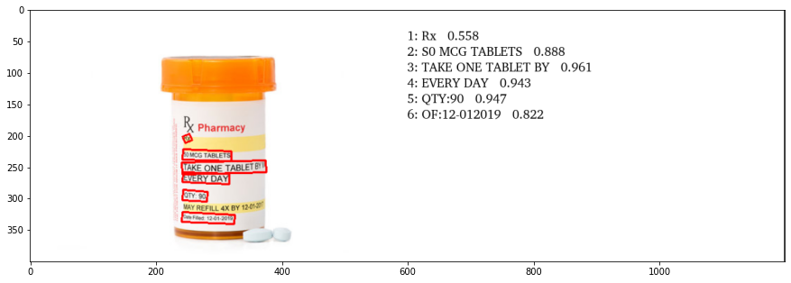

# OCR using PaddleOCR on Drug Medication Images

In this project I used the opensource [`PaddleOCR`](https://github.com/PaddlePaddle/PaddleOCR) to perform OCR on images. Using `PaddleOCR`, it makes it very easy to detect texts on images (in our case it is drug information extraction). We just need to get the bounding boxes from the detections and draw them on the final images to visualize the detections made by the PaddleOCR.

# How to run the notebook ⁉

Just run the notebook from start to end on Google Colab, every dependency is already mentioned in the notebook. Just run all the cells, just get your own images that you want to perform OCR detection on or just use the ones in the notebook.

# Example Detection

